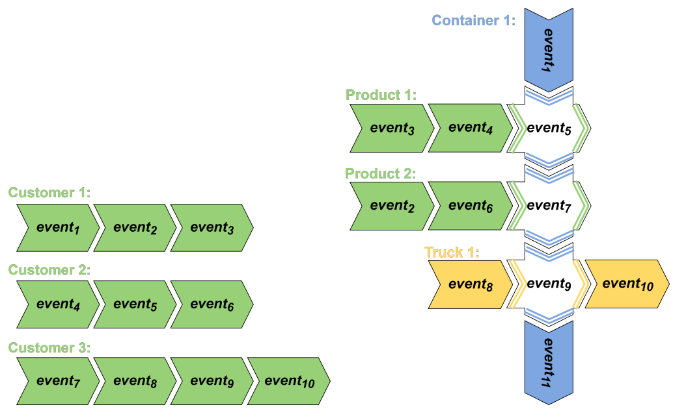
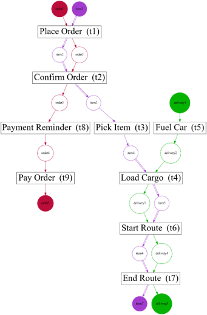
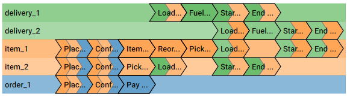
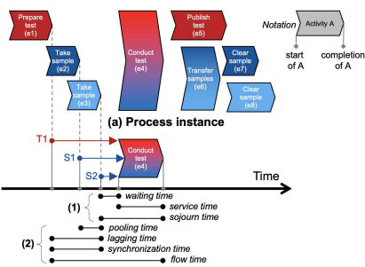

Object-Centric Process Analysis
===========================

[](https://ocpa.readthedocs.io/en/latest/index.html)
[](https://github.com/MShawon/github-clone-count-badge)


Object-Centric Process Mining: Moving from homogeneous event sequences
to heterogeneous event graphs.

Find the [Documentation](https://ocpa.readthedocs.io/) on readthedocs
and the relevant
[Paper](https://www.sciencedirect.com/science/article/pii/S2665963822001221?via%3Dihub)
at Software Impacts.

------------------------------------------------------------------------

**Citing**

If you find *ocpa* and the datasets useful in your research, please
consider citing the following paper:

``` {.text}
@article{ADAMS2022100438,
title = {ocpa: A Python library for object-centric process analysis},
journal = {Software Impacts},
pages = {100438},
year = {2022},
issn = {2665-9638},
doi = {https://doi.org/10.1016/j.simpa.2022.100438},
url = {https://www.sciencedirect.com/science/article/pii/S2665963822001221},
author = {Jan Niklas Adams and Gyunam Park and Wil M.P. {van der Aalst}},
keywords = {Process mining, Object-centric process mining, Object-centric petri net, Predictive process monitoring, Conformance checking, Performance analysis},
abstract = {ocpa is a Python library supporting object-centric process mining. Traditional process mining generates insights for one single process. However, many real-life processes are composed of multiple interacting subprocesses and events may involve multiple objects. Object-centric process mining provides techniques for analyzing multiple interacting processes by generalizing process mining techniques. ocpa contains algorithms for object-centric event log management, process discovery, conformance checking, enhancement, and predictive process monitoring. ocpa is easily integrable with existing solutions as it supports existing object-centric event log standards, provides extensive documentation, and is installable through the Python package installer.}
}
```

------------------------------------------------------------------------

**OCPA (Object-Centric Process Analysis)** is a Python library to enable
object-centric process mining. It covers the following functionalities:
* Object-centric event log management
  * Import  
    * From CSV 
    * From JSONOCEL & JSONXML 
    * From OCEL 2.0 Files
  * Export 
    - To JSONOCEL 
  - Process execution extraction (object-centric cases) 
- Object-centric process discovery 
  - Object-centric Petri nets 
  - Object-centric Variant calculation 
  - Control-flow visualization 
    - Object-centric Petri net 
    - Object-centric variants 
- Object-centric conformance checking 
  - Fitness & Precision 
  - Constraint monitoring 
- Object-centric process enhancement 
  - Performance analysis 
  - Model Analysis 
- Object-centric predictive process monitoring
  - Feature extraction
  - Feature encoding
  - Preprocessing

Installation
============

Install from Github

``` {.text}
git clone https://github.com/ocpm/ocpa.git
cd ocpa
pip install .
```

Install from Pip

``` {.text}
pip install ocpa
```

Event Log Management
====================

OCPA offers several ways to import object-centric event data.
Additionally to the two data formats introduced in the ([OCEL
standard](https://www.ocel-standard.org)) we support the import of CSV
files. The importer is the key interface to pass parameters and settings
to the event log. A full description can be found in the
`importer's documentation <ocpa.objects.log.importer.csv.factory.apply>`.

**Importing CSV Files**

``` {.python}
from ocpa.objects.log.importer.csv import factory as ocel_import_factory
filename = "sample_logs/csv/BPI2017-Final.csv"
object_types = ["application", "offer"]
parameters = {"obj_names":object_types,
          	"val_names":[],
          	"act_name":"event_activity",
          	"time_name":"event_timestamp",
          	"sep":","}
ocel = ocel_import_factory.apply(file_path= filename,parameters = parameters)
```

**Importing JSON OCEL/XML OCEL Files**

``` {.python}
from ocpa.objects.log.importer.ocel import factory as ocel_import_factory
filename = "sample_logs/jsonocel/p2p-normal.jsonocel"
ocel = ocel_import_factory.apply(filename)
```

**Importing OCEL 2.0 Files**

There are different formats for OCEL 2.0 files. All of them are extensively documented at the ([OCEL
standard](https://www.ocel-standard.org)) website. 

``` {.python}
from ocpa.objects.log.importer.ocel2.sqlite import factory as ocel_import_factory
filename = "sample_logs/ocel2/sqlite/running-example.sqlite"
ocel = ocel_import_factory.apply(filename)
```

**Exporting JSON OCEL Files**

``` {.python}
from ocpa.objects.log.importer.ocel import factory as ocel_import_factory
from ocpa.objects.log.exporter.ocel import factory as ocel_export_factory
filename = "sample_logs/jsonocel/p2p-normal.jsonocel"
ocel = ocel_import_factory.apply(filename)
ocel_export_factory.apply(
	ocel, './exported-p2p-normal_export.jsonocel')
```

**Process Execution Extraction & Management** The technique passed
through the parameters determines how process executions will be
retrieved for the event log. The default technique are connected
components. The process executions are extracted upon calling the
corresponding property the first time.

``` {.python}
from ocpa.objects.log.importer.ocel import factory as ocel_import_factory
filename = "../../sample_logs/jsonocel/p2p-normal.jsonocel"
ocel = ocel_import_factory.apply(filename)
print("Number of process executions: "+str(len(ocel.process_executions)))
print("Events of the first process execution: "+str(ocel.process_executions[0]))
print("Objects of the first process execution: "+str(ocel.process_execution_objects[0]))
print("Process execution graph of the first execution:")
print(ocel.get_process_execution_graph(0))
print("Process execution of the first event with event id 0: "+str(ocel.process_execution_mappings[0]))
```

**Import with Parameters**

``` {.python}
from ocpa.objects.log.importer.ocel import factory as ocel_import_factory
filename = "sample_logs/jsonocel/p2p-normal.jsonocel"
parameters = {"execution_extraction": "leading_type",
          	"leading_type": "GDSRCPT",
          	"variant_calculation": "two_phase",
          	"exact_variant_calculation":True}
ocel = ocel_import_factory.apply(filename)
print(len(ocel.variants))
```

Object-Centric Process Discovery
====================
A process model of the
object-centric event log can be discovered by applying the discovery
algorithm for object-centric Petri nets. The corresponding retrieved
object retrieved is of the class
`Object-centric Petri net <ocpa.objects.oc_petri_net.obj.ObjectCentricPetriNet>`. Objects of this class can be visualized by calling the
corresponding visualization function.

**Object-Centric Petri Net Retrieval & Visualization**



Example of a visualized object-centric Petri net

``` {.python}
from ocpa.objects.log.importer.ocel import factory as ocel_import_factory
from ocpa.algo.discovery.ocpn import algorithm as ocpn_discovery_factory
from ocpa.visualization.oc_petri_net import factory as ocpn_vis_factory
filename = "sample_logs/jsonocel/p2p-normal.jsonocel"
ocel = ocel_import_factory.apply(file_path=filename)
ocpn = ocpn_discovery_factory.apply(ocel, parameters={"debug": False})
ocpn_vis_factory.save(ocpn_vis_factory.apply(ocpn), "oc_petri_net.png")
```

**Variant Calculation and Layouting** Equivalent control-flow behavior
of process executions are called variants. Since a process execution is
a graph, we can find equivalent process executions by annotating each
graph\'s nodes with the activity attribute and finding isomorphic
graphs. OCPA offers two techniques to determine variants: By first
calculating lexicographical presentations of the graphs and then
refining these (TWO_PHASE), and through one-to-one isomorphism checking
(ONE_PHASE). The first is normally faster. One can also choose to use
the approximation of variants through only the lexicographical
presentation. This is the default procedure, but can be switched off by
passing the right parameter (see example below). The variant layouting
just returns a positioning of chevrons as coordinates. The visualization
has to be done using another tool (www.ocpi.ai implements this
end-to-end)



A variant visualized with [OCpi](https://ocpi.ai) following the
layouting algorithm.

``` {.python}
from ocpa.objects.log.importer.ocel import factory as ocel_import_factory
from ocpa.visualization.log.variants import factory as variants_visualization_factory
filename = "sample_logs/jsonocel/p2p-normal.jsonocel"
ocel = ocel_import_factory.apply(filename)
print("Number of process executions: "+str(len(ocel.process_executions)))
print("Number of variants: "+str(len(ocel.variants)))
variant_layouting = variants_visualization_factory.apply(ocel)
print(variant_layouting[ocel.variants[0]])
```

Object-Centric Conformance Checking
====================
OCPA offers two main ways of
conformance checking: By calculating fitness, i.e., the share of events
that can be replayed in the object-centric Petri net, and by constraint
monitoring.

**Precision and Fitness** One can calculate precision and fitness by
comparing an object-centric Petri net to an object-centric event log.

``` {.python}
from ocpa.objects.log.importer.ocel import factory as ocel_import_factory
from ocpa.algo.conformance.precision_and_fitness import evaluator as quality_measure_factory
from ocpa.algo.discovery.ocpn import algorithm as ocpn_discovery_factory
filename = "sample_logs/jsonocel/p2p-normal.jsonocel"
ocel = ocel_import_factory.apply(filename)
ocpn = ocpn_discovery_factory.apply(ocel, parameters = {"debug":False})
precision, fitness = quality_measure_factory.apply(ocel, ocpn)
print("Precision of IM-discovered net: "+str(precision))
print("Fitness of IM-discovered net: "+str(fitness))
```

**Constraint monitoring** As well as the conformance of event logs to
process models, OCPA also offers the conformance (compliance) of event
logs to user-defined constraints. Such constraints describe
control-flow, object-involvement, and performance constraints.

``` {.python}
from ocpa.objects.log.importer.ocel import factory as ocel_import_factory
from ocpa.algo.discovery.ocpn import algorithm as ocpn_discovery_factory
from ocpa.algo.enhancement.token_replay_based_performance import algorithm as performance_factory
from ocpa.objects.graph.constraint_graph.obj import ConstraintGraph, ActivityNode, ObjectTypeNode, FormulaNode, ControlFlowEdge, ObjectRelationEdge, PerformanceEdge
import ocpa.algo.conformance.constraint_monitoring.algorithm as constraint_monitoring_factory

filename = "<path-to-your-log>"
ocel = ocel_import_factory.apply(filename)
ocpn = ocpn_discovery_factory.apply(ocel)
diag_params = {'measures': ['act_freq', 'arc_freq', 'object_count', 'waiting_time', 'service_time', 'sojourn_time', 'synchronization_time', 'pooling_time', 'lagging_time', 'flow_time'], 'agg': [
	'mean', 'min', 'max']}
diag = performance_factory.apply(ocpn, ocel, parameters=diag_params)

# Example1: VM and PGI should not be concurrently executed.
cg1 = ConstraintGraph('Example1')
act_vm = ActivityNode('Verify Material')
act_pgi = ActivityNode('Plan Goods Issue')
cg1.add_nodes([act_vm, act_pgi])
cf1 = ControlFlowEdge(act_vm, act_pgi, 'concur', 'MATERIAL', 0.1)
cg1.add_cf_edge(cf1)
violated, diagnostics = constraint_monitoring_factory.apply(
	cg1, ocel, diag, parameters=None)
if violated:
	print(diagnostics)

# Example2: CPR should alway be followed by CPO.
cg2 = ConstraintGraph('Example2')
act_cpr = ActivityNode('Create Purchase Requisition (CPR)')
act_cpo = ActivityNode('Create Purchase Order (CPO)')
cg2.add_nodes([act_cpr, act_cpo])
cf2 = ControlFlowEdge(act_cpr, act_cpo, 'causal', 'PURCHREQ', 0.99)
cg2.add_cf_edge(cf2)
violated, diagnostics = constraint_monitoring_factory.apply(
	cg2, ocel, diag, parameters=None)
if violated:
	print(diagnostics)

# Example3: CPR should not be skipped
cg3 = ConstraintGraph('Example3')
act_cpr = ActivityNode('Create Purchase Requisition (CPR)')
cg3.add_nodes([act_cpr])
cf3 = ControlFlowEdge(act_cpr, act_cpr, 'skip', 'PURCHREQ', 0)
cg3.add_cf_edge(cf3)
violated, diagnostics = constraint_monitoring_factory.apply(
	cg3, ocel, diag, parameters=None)
if violated:
	print(diagnostics)

# Example4: PGI should always involve PURCHORD
cg4 = ConstraintGraph('Example4')
act_pgi = ActivityNode('Plan Goods Issue')
obj_node1 = ObjectTypeNode('PURCHORD')
cg4.add_nodes([act_pgi, obj_node1])
or1 = ObjectRelationEdge(obj_node1, act_pgi, 'absent', 0)
cg4.add_obj_edge(or1)
violated, diagnostics = constraint_monitoring_factory.apply(
	cg4, ocel, diag, parameters=None)
if violated:
	print(diagnostics)

# Example5: PGI should not involve MATERIAL
cg5 = ConstraintGraph('Example5')
act_pgi = ActivityNode('Plan Goods Issue')
obj_node2 = ObjectTypeNode('MATERIAL')
cg5.add_nodes([act_cpr])
or2 = ObjectRelationEdge(obj_node2, act_pgi, 'present', 0)
cg5.add_obj_edge(or2)
violated, diagnostics = constraint_monitoring_factory.apply(
	cg5, ocel, diag, parameters=None)
if violated:
	print(diagnostics)

# Example6: CPO should involve only one PURCHORD
cg6 = ConstraintGraph('Example6')
act_cpo = ActivityNode('Create Purchase Order (CPO)')
obj_node1 = ObjectTypeNode('PURCHORD')
cg6.add_nodes([obj_node1, act_cpo])
or3 = ObjectRelationEdge(obj_node1, act_cpo, 'singular', 0.99)
cg6.add_obj_edge(or3)
violated, diagnostics = constraint_monitoring_factory.apply(
	cg6, ocel, diag, parameters=None)
if violated:
	print(diagnostics)

# Example7: CPO should mostly involve multiple PURCHORD
cg7 = ConstraintGraph('Example7')
act_cpo = ActivityNode('Plan Goods Issue')
obj_node2 = ObjectTypeNode('MATERIAL')
cg7.add_nodes([act_cpo, obj_node2])
or4 = ObjectRelationEdge(obj_node2, act_cpo, 'multiple', 0.7)
cg7.add_obj_edge(or4)
violated, diagnostics = constraint_monitoring_factory.apply(
	cg7, ocel, diag, parameters=None)
if violated:
	print(diagnostics)
```

Object-Centric Process Enhancement
====================

**Performance Analysis** OCPA offers object-centric performance
analysis. The performance analysis considers the interaction of objects
in business processes, producing accurate waiting, service, and sojourn
times. Moreover, it provides insightful object-centric performance
metrics such as lagging, pooling, synchronization, and flow times.



New performance metrics on object-centric event data.

``` {.python}
filename = "./sample_logs/jsonocel/p2p-normal.jsonocel"
ocel = ocel_import_factory.apply(filename)
ocpn = ocpn_discovery_factory.apply(ocel)
diag_params = {'measures': ['act_freq', 'arc_freq', 'object_count', 'waiting_time', 'service_time', 'sojourn_time', 'synchronization_time', 'pooling_time', 'lagging_time', 'flow_time'], 'agg': [
	'mean', 'min', 'max'], 'format': 'svg'}
diag = performance_factory.apply(ocpn, ocel, parameters=diag_params)
print(f'Diagnostics: {diag}')
gviz = ocpn_vis_factory.apply(
	ocpn, diagnostics=diag, variant="annotated_with_opera", parameters=diag_params)
ocpn_vis_factory.view(gviz)
```

Object-Centric Predictive Process Monitoring
===================
OCPA offers extensive support for
predictive process monitoring. This comes in form of features
extraction, encoding and preprocessing functionality. Features are
extracted based on the true, graph-like structure of object-centric
event data. Depending on the use case, users can decide to encode
object-centric features in one of three ways: Tabluer, Sequential or
graph. The extracted features can already be normalized and split into
training and testing set.

**Feature extraction**

``` {.python}
from ocpa.objects.log.importer.ocel import factory as ocel_import_factory
from ocpa.algo.predictive_monitoring import factory as predictive_monitoring
filename = "sample_logs/jsonocel/p2p-normal.jsonocel"
ocel = ocel_import_factory.apply(filename)
activities = list(set(ocel.log.log["event_activity"].tolist()))
feature_set = [(predictive_monitoring.EVENT_REMAINING_TIME, ()),
           	(predictive_monitoring.EVENT_PREVIOUS_TYPE_COUNT, ("GDSRCPT",)),
           	(predictive_monitoring.EVENT_ELAPSED_TIME, ())] + \
          	[(predictive_monitoring.EVENT_PRECEDING_ACTIVITES, (act,)) for act in activities]
feature_storage = predictive_monitoring.apply(ocel, feature_set, [])
```

The extracted features come in form of a
`Feature Storage <ocpa.algo.feature_extraction.obj.Feature_Storage>`. A feature storage contains a list of feature graphs. Each
feature graph represents one process execution. Each node represents an
event. The feature values extracted for events are stored as a
dictionary. The feature values for a process execution are, also, stored
as a dictionary associated with the feature graph. Feature functions are
predefined (can of course be extended). A function is identified with
the corresponding string. Parameters are passed as a tuple.

**Feature Encoding** The feature storage has an underlying graph
structure. OCPA allows the user to transform this graph structure to a
sequential or a tabular encoding.

``` {.python}
from ocpa.objects.log.importer.ocel import factory as ocel_import_factory
from ocpa.algo.predictive_monitoring import factory as predictive_monitoring
from ocpa.algo.predictive_monitoring import tabular, sequential
filename = "sample_logs/jsonocel/p2p-normal.jsonocel"
ocel = ocel_import_factory.apply(filename)
activities = list(set(ocel.log.log["event_activity"].tolist()))
feature_set = [(predictive_monitoring.EVENT_REMAINING_TIME, ()),
           	(predictive_monitoring.EVENT_PREVIOUS_TYPE_COUNT, ("GDSRCPT",)),
           	(predictive_monitoring.EVENT_ELAPSED_TIME, ())] + \
          	[(predictive_monitoring.EVENT_PRECEDING_ACTIVITES, (act,)) for act in activities]
feature_storage = predictive_monitoring.apply(ocel, feature_set, [])
table = tabular.construct_table(feature_storage)
sequences = sequential.construct_sequence(feature_storage)
```

**Preprocessing** Since predictive process monitoring is the most common
use case of feature extraction and encoding, OCPA allow the user to
split and normalize the feature storage for training and testing. The
share of test split is necessary, as well as the state for random
splitting.

``` {.python}
from ocpa.objects.log.importer.ocel import factory as ocel_import_factory
from ocpa.algo.predictive_monitoring import factory as predictive_monitoring
from ocpa.algo.predictive_monitoring import tabular

filename = "sample_logs/jsonocel/p2p-normal.jsonocel"
ocel = ocel_import_factory.apply(filename)
activities = list(set(ocel.log.log["event_activity"].tolist()))
feature_set = [(predictive_monitoring.EVENT_REMAINING_TIME, ()),
           	(predictive_monitoring.EVENT_PREVIOUS_TYPE_COUNT, ("GDSRCPT",)),
           	(predictive_monitoring.EVENT_ELAPSED_TIME, ())] + \
          	[(predictive_monitoring.EVENT_PRECEDING_ACTIVITES, (act,)) for act in activities]
feature_storage = predictive_monitoring.apply(ocel, feature_set, [])
feature_storage.extract_normalized_train_test_split(0.3, state = 3395)
train_table = tabular.construct_table(
    	feature_storage, index_list=feature_storage.training_indices)
test_table = tabular.construct_table(
    	feature_storage, index_list=feature_storage.test_indices)
```

**Full Example**

``` {.python}
from ocpa.util.util import LinearRegression
from ocpa.util.util import mean_absolute_error
from ocpa.objects.log.importer.ocel import factory as ocel_import_factory
from ocpa.algo.predictive_monitoring import factory as predictive_monitoring
from ocpa.algo.predictive_monitoring import tabular

filename = "sample_logs/jsonocel/p2p-normal.jsonocel"
ocel = ocel_import_factory.apply(filename)
activities = list(set(ocel.log.log["event_activity"].tolist()))
feature_set = [(predictive_monitoring.EVENT_REMAINING_TIME, ()),
           	(predictive_monitoring.EVENT_PREVIOUS_TYPE_COUNT, ("GDSRCPT",)),
           	(predictive_monitoring.EVENT_ELAPSED_TIME, ())] + \
          	[(predictive_monitoring.EVENT_PRECEDING_ACTIVITES, (act,)) for act in activities]
feature_storage = predictive_monitoring.apply(ocel, feature_set, [])
feature_storage.extract_normalized_train_test_split(0.3, state = 3395)
train_table = tabular.construct_table(
    	feature_storage, index_list=feature_storage.training_indices)
test_table = tabular.construct_table(
    	feature_storage, index_list=feature_storage.test_indices)
y_train, y_test = train_table[feature_set[0]], test_table[feature_set[0]]
x_train, x_test = train_table.drop(
    	feature_set[0], axis=1), test_table.drop(feature_set[0], axis=1)
model = LinearRegression()
model.fit(x_train, y_train)
y_pred = model.predict(x_test)
avg_rem = sum(y_train)/len(y_train)
print('MAE baseline: ', mean_absolute_error(
	y_test, [avg_rem for elem in y_test]))
print('MAE: ', mean_absolute_error(y_test, y_pred))
```
